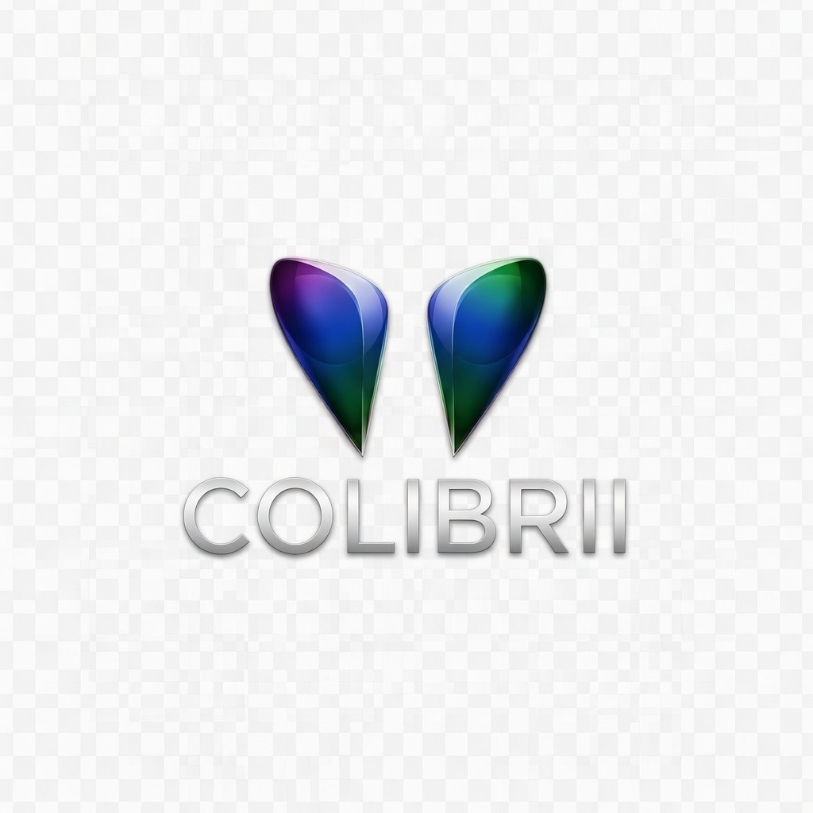

<p align="center">
  
</p>

<h1 align="center">Colibrii Labs — AI Observatory</h1>

<p align="center">
  <strong>Latin America's First Real-Time AI Readiness Intelligence Platform</strong><br/>
  Tracking 193 countries across governance, infrastructure, innovation, and social impact.
</p>

<p align="center">
  <a href="https://colibriilabs.ai">🌐 Live Platform</a> ·
  <a href="docs/01_Executive_Summary.md">📋 Executive Summary</a> ·
  <a href="docs/02_Technical_Summary.md">🔧 Technical Docs</a> ·
  <a href="docs/03_Full_Documentation.md">📖 Full Reference</a>
</p>

<p align="center">
  
  
  
  
  
  
  
</p>

---

## What is this?

Colibrii Labs is a **bilingual (ES/EN) strategic intelligence platform** that monitors, analyzes, and visualizes artificial intelligence readiness, risk, and policy across **20 peer countries**, with a primary focus on **Costa Rica**.

It combines **live data from 4 APIs** with **25+ institutional data sources**, processed through **10 proprietary algorithms**, to deliver actionable intelligence for decision-makers navigating the AI transformation.

> **The core insight:** Costa Rica scored **100/100** on AI government vision (Oxford Insights 2024) but only **0.38/1.0** on actual AI readiness — with **zero** binding AI laws. This observatory exists to close that gap.

---

## Key Features

### 23 Analysis Tabs across 6 Groups

| Group | Tabs | What It Covers |
|-------|------|---------------|
| **Intelligence** | Home, Free Trade Zones, Physical AI, SMEs, Media | Live dashboard, FDI analysis, humanoid robot impact, PYME intelligence, GDELT news |
| **Policy** | Legislation, Security | 7 global AI laws analyzed, 6 AI-specific threats, Conti 2022 case study |
| **Training** | Education, Glossary | 8 CR AI education programs, 55 bilingual glossary terms |
| **Impact** | Health AI, Food Security, Governance, Environment, Infrastructure, AI Readiness, Showcase, UN Goals | ITU AI for Good integration, 16 case studies, SDG alignment |
| **Tools** | Index, Countries, Compare, Algorithms, Simulator | CAPI-CR leaderboard, 20-country profiles, radar comparison, policy what-if simulator |
| **About** | Info | Methodology transparency, data attribution |

### CAPI-CR — Proprietary Composite Index

The **Colibrii AI Preparedness Index for Costa Rica (CAPI-CR)** is a 6-dimension composite index ranking 20 countries on AI readiness:

| Dimension | Weight | Source |
|-----------|--------|--------|
| Digital Infrastructure | 20% | World Bank API (live) |
| Human Capital | 20% | World Bank API (live) |
| Innovation | 15% | World Bank API (live) |
| AI Regulation | 15% | Expert-curated |
| Sustainable Energy | 15% | World Bank API (live) |
| Digital Security | 15% | Expert-curated |

### Live API Integrations

| API | Data | Refresh |
|-----|------|---------|
| **World Bank** | 11 indicators × 20 countries | 30-min cache |
| **GDELT Project** | AI + Costa Rica news (last 7 days) | Real-time |
| **Exchange Rate API** | USD/CRC rate | Per session |
| **World Atlas (jsDelivr)** | TopoJSON for interactive world map | Static |

### Additional Highlights

- **Bilingual** — Every word, metric, and analysis in Spanish + English
- **Dark/Light theme** — Persisted to localStorage
- **Zero cookies, zero tracking** — Privacy-first architecture
- **Policy Simulator** — 6 interactive sliders to model "what if Costa Rica..." scenarios
- **55 glossary terms** — With Costa Rica context and optional technical deep dives
- **WEF 2026 Risk Dashboard** — 3 time horizons (2026, 2028, 2036) with CR blind spot analysis
- **10 proprietary algorithms** — CAPI-CR (active), IVAS & TIPAI (in development), 7 planned
- **37 custom SVG icons** — Hand-crafted 24×24 icon system

---

## Tech Stack

| Layer | Technology | Purpose |
|-------|-----------|---------|
| **Framework** | Next.js 14 (App Router) | SSG, routing, dynamic imports, API routes |
| **UI** | React 18 | Component architecture, hooks, client-side state |
| **Animation** | Framer Motion 12 | Page transitions, scroll reveals, accordions |
| **Charts** | Recharts 2.15 | Radar, bar, area, line charts, treemap |
| **Maps** | react-simple-maps 3.0 | Interactive world map with TopoJSON |
| **Analytics** | Vercel Analytics + Speed Insights | Page views, Core Web Vitals |
| **Hosting** | Vercel Edge Network | Global CDN, serverless functions |
| **Backend** | None | Zero-backend architecture |
| **Database** | None | Data-as-code (276KB JS module, 50+ exports) |

**Total dependencies:** 8 production + 2 dev. **Build output:** ~240KB First Load JS.

---

## Architecture

```
User visits colibriilabs.ai
        │
        ├── / (Marketing Landing Page)
        │     └── LandingPage.jsx → conversion-focused, 9 sections
        │
        ├── /app (Observatory Portal)
        │     └── PortalShell.jsx → 23-tab SPA with state management
        │           │
        │           ├── World Bank API ──→ 11 indicators × 20 countries
        │           ├── GDELT API ──────→ Live AI news feed
        │           ├── Exchange Rate ──→ USD/CRC display
        │           └── data.js ────────→ 276KB curated intelligence module
        │                 │
        │                 ├── CAPI-CR Pipeline: Fetch → Normalize → Weight → Rank
        │                 ├── 55 glossary terms (bilingual, CR context)
        │                 ├── 20 country profiles (radar, governance, strategy)
        │                 ├── 10 algorithm definitions
        │                 └── 50+ named exports
        │
        └── /api/rss (RSS 2.0 Feed)
```

---

## Performance Optimizations

- **Code splitting** — All 23 tab components loaded via `next/dynamic`
- **Lazy-loaded Recharts** — ~200KB deferred until below-the-fold radar chart is needed
- **API preconnects** — DNS/TLS handshake starts during HTML parse
- **Memoized computations** — `useMemo` for expensive function calls
- **Consolidated mount effects** — Single `useEffect` for 3 initialization tasks
- **Async image decoding** — `decoding="async"` on flag images
- **30-minute API cache** — sessionStorage with TTL
- **Parallel fetching** — `Promise.allSettled` for all API calls

---

## Security

| Header | Value |
|--------|-------|
| Content-Security-Policy | Restrictive CSP (only required origins) |
| X-Frame-Options | DENY |
| X-Content-Type-Options | nosniff |
| Referrer-Policy | origin-when-cross-origin |
| Permissions-Policy | camera=(), microphone=(), geolocation=() |

**Privacy:** Zero cookies. Zero tracking. Zero user data collection. Only `localStorage` for language/theme preference.

---

## Project Structure

```
├── app/
│   ├── layout.js                    # Root layout (fonts, metadata, JSON-LD)
│   ├── globals.css                  # Global styles (~1,900 lines)
│   ├── (marketing)/page.js          # Landing page
│   ├── (portal)/app/page.js         # Observatory portal
│   └── api/rss/route.js             # RSS 2.0 feed
├── components/
│   ├── portal/                      # Shell, Sidebar, BottomNav, IndicatorDrawer
│   ├── marketing/                   # Landing page, Header, Footer
│   ├── system/Icon.jsx              # 37 custom SVG icons
│   ├── ui.jsx                       # 22+ reusable UI components
│   ├── data.js                      # Master data module (276KB, 50+ exports)
│   ├── HomeView.jsx                 # Home dashboard
│   ├── [16 more tab components]     # One per analysis view
│   └── [supporting components]      # WorldMap, RiskHeatmap, NewsSection, TikTok
├── data/facts.js                    # Dynamic counts (single source of truth)
├── public/                          # Favicon, OG image, logo, manifest, sitemap
└── docs/                            # Executive, technical, and full documentation
```

---

## Data Sources (25+)

World Bank · OECD · World Economic Forum · UNESCO · GDELT Project · PROCOMER · CINDE · IMF · ILO · Oxford Insights · Stanford HAI · Transparency International · Freedom House · Institute for Economics & Peace · OWASP · Goldman Sachs · International Federation of Robotics · UNDP · FAO · WHO · UNCTAD · IDB · Deloitte · McKinsey · Bank of America · ITU

---

## Getting Started

```bash
# Clone the repository
git clone https://github.com/White-Rabbit256/colibrii-ai-observatory.git
cd colibrii-ai-observatory

# Install dependencies
npm install

# Run development server
npm run dev

# Build for production
npm run build

# Start production server
npm start
```

Open [http://localhost:3000](http://localhost:3000) for the landing page, or [http://localhost:3000/app](http://localhost:3000/app) for the observatory portal.

---

## Documentation

| Document | Audience | Content |
|----------|----------|---------|
| [Executive Summary](docs/01_Executive_Summary.md) | Stakeholders, investors, press | Platform vision, capabilities, differentiators |
| [Technical Summary](docs/02_Technical_Summary.md) | Engineers, technical reviewers | Stack, architecture, APIs, scoring pipeline |
| [Full Documentation](docs/03_Full_Documentation.md) | Contributors, deep reference | All 23 tabs, every component, data structures, CSS |

---

## Team

| Role | Name | Contact |
|------|------|---------|
| **Founder** | Andres Alpizar | [LinkedIn](https://www.linkedin.com/in/andresalpizar/) · [X](https://x.com/ColibriiLabs) |
| **CEO & Co-founder** | M.Sc. Mariam Rodriguez Rojas | [LinkedIn](https://www.linkedin.com/in/mariam-rodr%C3%ADguez-rojas-15353b140/) |

**Contact:** andres@colibriilabs.com

---

## License

This project is licensed under [CC BY-NC 4.0](https://creativecommons.org/licenses/by-nc/4.0/) — free for non-commercial use with attribution. Underlying data retains its original institutional licenses.

---

<p align="center">
  <strong>Colibrii Labs — Agile Intelligence</strong><br/>
  <em>Latin America's First Real-Time AI Observatory</em><br/>
  <a href="https://colibriilabs.ai">colibriilabs.ai</a>
</p>
